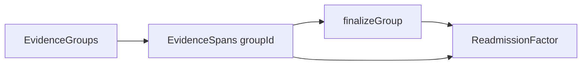

# Readmission annotation — technical architecture

## 1. Raw notes and section metadata

Each case stores **immutable raw** discharge summaries (`indexRawNote` / `readmissionRawNote`). The polish pipeline (`notebooks/polish_notes.ipynb`) **does not rewrite** this text.

**Offsets for highlighting** always use the raw string. `note_version_hash` is computed from the raw pair and is unchanged by section labeling.

**Section labels** are stored in `index_note_sections` / `readmit_note_sections` as JSON: `{ id, title, startChar, endChar }` with offsets into the **raw** note. Used for `EvidenceSpan.sectionTitle` and `sectionId` at highlight time and in exports.

**Enrichment revision:** `note_enrichment_version` (e.g. `sections-rules-v1`) bumps when section JSON changes. It does **not** change `note_version_hash` or invalidate in-progress annotations. Opening a case online refreshes cached case rows when enrichment version changes.

**Full cohort artifact:** `src/data/readmit_30d_sections.parquet` (from `export_sections_parquet.py`) stores section JSON for every parquet row for research/QA; Supabase assigned cases are updated by `polish_notes.ipynb`.

## 2. Section detection

When the polish pipeline has run, section boundaries come from stored JSON (`sections-rules-v1`). The batch uses a **rules-first engine** driven by `section_lexicon.json` (inline MIMIC-style headings, alias normalization, metadata denylist). No LLM is required for section labeling.

The frontend fallback (`detectSections.ts`) mirrors the same lexicon when stored sections are absent. Each section has:

- `sectionTitle` — captured heading text as it appears in the note
- `startChar` / `endChar` — indices into the full raw note
- `rawText` — `rawNote.slice(startChar, endChar)` with no trimming

Content before the first heading is exposed as a **Preamble** section. Section boundaries are used only for navigation and metadata; they do not alter the canonical string.

Run `notebooks/inspect_note_headings.ipynb` to mine heading frequencies from the cohort and tune `section_lexicon.json` before batch labeling.

**Magic Beta (UI-only):** A sparkle **Beta** toggle beside the note layout controls enables a single-note section reading view. It shows a left-hand section TOC, bold section headers, and separated blocks — all rendered from the same `NoteDocument` segment spans (raw char offsets unchanged). Available only in index-only or readmission-only layout (disabled in split view). Preference persists in `localStorage` (`readmission:magic-beta-v1`). When stored sections are missing, the UI falls back to client `detectSections()` via `resolvedStoredSections()`.

## 3. Annotation section metadata

Each `EvidenceSpan` stores `sectionTitle` and optional `sectionId` (snapshot at highlight time). On save/submit, annotations also store optional `noteEnrichmentVersion` and `sectionMetaSource` (`stored` | `detected`). Export JSON adds `factorSectionSummary` (unique sections touched per finalized factor). Missing `sectionId` values are backfilled from stored case sections on load when possible.

## 4. Text selection → character offsets

The note is rendered via **interval segmentation** (`buildNoteSegments.ts`): boundaries include note edges, section edges, and all evidence span edges. Each atomic interval is rendered as one `` or `<mark>` with `data-char-start` and `data-char-end`.

When the clinician selects text, `selectionToOffsets.ts` (wrapped by `noteHighlighter.ts`):

1. Resolves anchor/focus positions using the nearest ancestor carrying `data-char-start`, plus text-node offsets within that span.
2. Sets `selectedText = rawNote.slice(startChar, endChar)`.
3. Validates `normalizeWs(browserSelection) === normalizeWs(selectedText)` (whitespace collapsed to single spaces, ends trimmed). On failure, highlighting is blocked.

Evidence spans are stored only after successful validation.

## 5. Factor-first workflow (single panel)

- New cases start with **Factor 1** (amber) active; clinicians **add** more factors via `addEvidenceGroup` with auto-assigned colors (`evidenceGroupPalette.ts`).
- Select an active factor, highlight passages in the note (`groupId` on spans; `factorId: null` until complete).
- In **`FactorWorkbenchPanel`**: review snippets, enter clinical metadata, **Save & complete factor** (`finalizeGroup()`).
- Completed factors set `group.finalizedFactorId` and link spans via `factorId`. Factors can be **deleted** (`removeEvidenceGroup`) with cascade of spans and linked records.
- Export JSON unchanged: `evidenceGroups`, `evidenceSpans`, `factors`.

### Flat note rendering

- The note body renders as one continuous `.note-root` stream (`NoteDocument` + `NoteSegmentSpan`) — no per-section UI and no Sections sidebar. `buildNoteSegments` does **not** split on section boundaries (only note edges + highlight edges).
- `sectionsForNote` / `detectSections` supply `EvidenceSpan.sectionTitle` and optional `sectionId` at highlight time, not for layout.
- **Floating toolbar only** — `FloatingSelectionToolbar` near the selection calls `addHighlightToActiveGroup` (no in-header preview panel; stable note header).

## 6. Libraries chosen (and not chosen)

| Library | Decision |
|--------|----------|
| **Recogito / text-annotator-js** | Not used. Offset fidelity and section TOC require custom rendering. |
| **react-markdown** | Not used for the note body. |
| **Custom renderer** | Interval segments, `data-char-*`, `<mark>` colored by `EvidenceGroup.color`. |
| **noteHighlighter.ts** | Thin wrapper over `selectionToOffsets` for future library swap without changing export schema. |

## 7. UX stability

- **Floating toolbar** — `FloatingSelectionToolbar` shows “Highlight as [group]” at the selection; active factor chip shows a pulse when selection is ready.
- **Error boundary** — `ReadmissionErrorBoundary` wraps the tab; reload instead of white screen.
- **Draft persistence** — debounced `localStorage` autosave keyed by `caseId` + `reviewerId`; restore when `noteVersionHash` matches.
- **Reducer** — `annotationReducer.ts` centralizes add/remove group and span mutations (hook is a thin wrapper).
- **Fixed-height grid** — `ReadmissionTab` three-column layout; independent scroll regions.
- **Scroll preservation** — `noteScrollRef.scrollTop` saved/restored after span mutations.
- **Toast overlay** — `AnnotationToast` for status; no footer banners.
- **Per-group colors** — `groupColors.ts` maps `EvidenceGroupColor` → soft highlight backgrounds.
- **Overlap policy** — highlights cannot overlap spans in a **different** group (`findOverlappingOtherGroupSpan`).

## 8. Validation

**Draft:** permissive — highlights-only allowed.

**Submit:**

- At least one finalized factor
- Required metadata per factor; spans linked via `factorId`
- Offset/text/hash checks on every span
- Warnings for incomplete factors (highlights present but not completed)

## 9. API boundary (stub)

`readmissionApi.ts` exposes `loadCase`, `loadAnnotation`, `saveAnnotation`, `submitAnnotation` — mock + `localStorage` until backend exists. Export contract documented in `exportAnnotationSchema.ts`.

## 10. Limitations before backend integration

- Mock cases only; single case in milestone.
- No server persistence, auth, or multi-reviewer adjudication.
- Section labels from polish or regex; stored sections preferred over client regex when present.
- No merge/split groups in v1.
- `noteVersionHash` computed client-side in fixtures.

## 11. Troubleshooting highlights

**White screen** — check the browser console; reload via the error boundary. Common causes: invalid nested buttons (fixed in factor cards), or `activeGroupId` pointing at a deleted group (guarded by `resolveActiveGroupId`).

**Highlights only appear after you click Highlight** — selecting text alone does not color the note. **Factor 1** is preset; use **Add another factor** at the top of the right panel. Select text, then click **Highlight as [factor]** in the floating toolbar only.

**Why not `react-selection-highlighter`?** That library works on HTML strings and does not preserve exact character offsets into an immutable `rawNote`. This app uses a custom interval renderer with `data-char-start` / `data-char-end` and `selectionToOffsets.ts` for research-grade offset fidelity.

**Toolbar disappears when moving to click** — fixed by sticky `pendingSelectionRef` (commit reads the ref even if the browser collapses the selection) and `onMouseDown={(e) => e.preventDefault()}` on toolbar buttons so the text selection is not cleared before `onClick`.

**Toolbar position when selection collapses** — `FloatingSelectionToolbar` caches the last selection rect and falls back to a DOM anchor at `data-char-start="${pendingSelection.startChar}"` inside `.note-root`.

**Mapping error banner** — if offset validation fails (`normalizeWs` mismatch), an amber banner appears under the note header. Shorten the selection to text within one paragraph; do not clear the error until you select again or dismiss.

**Manual smoke test** — see [`readmission-release-checklist.md`](./readmission-release-checklist.md).

**Automated tests** — `npm run test` (Vitest): `selectionToOffsets`, `annotationReducer`, `evidenceGroupPalette`, `buildNoteSegments`.
