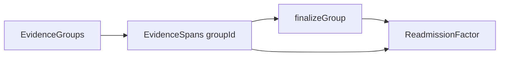

# Readmission annotation — technical architecture

## 1. Raw-note immutability

The canonical readmission discharge note is stored as a single immutable string on each mock case (`ReadmissionCase.rawNote`). It is never passed through `setState` mutators or string transformation pipelines (no summarization, paraphrase, reorder, or trim for display).

All UI rendering uses exact slices: `rawNote.slice(startChar, endChar)`. Evidence spans persist `startChar`, `endChar`, and `selectedText` where `selectedText` must equal that slice. A `noteVersionHash` (FNV-1a in mock fixtures; SHA-256 when `crypto.subtle` is available) is stored on the annotation and validated at submit time.

## 2. Section detection

Sections are detected with a line-start regex over a controlled list of clinical headings (Chief Complaint, HPI, PMH, etc.) in `detectSections.ts`. Each match yields:

- `sectionTitle` — captured heading text as it appears in the note
- `startChar` / `endChar` — indices into the full raw note
- `rawText` — `rawNote.slice(startChar, endChar)` with no trimming

Content before the first heading is exposed as a **Preamble** section. Section boundaries are used only for navigation and metadata; they do not alter the canonical string.

Future Ollama/API assistance may propose boundaries only as `{ startChar, endChar }` pairs validated against `rawNote`, never as rewritten note text.

## 3. Text selection → character offsets

The note is rendered via **interval segmentation** (`buildNoteSegments.ts`): boundaries include note edges, section edges, and all evidence span edges. Each atomic interval is rendered as one `` or `<mark>` with `data-char-start` and `data-char-end`.

When the clinician selects text, `selectionToOffsets.ts` (wrapped by `noteHighlighter.ts`):

1. Resolves anchor/focus positions using the nearest ancestor carrying `data-char-start`, plus text-node offsets within that span.
2. Sets `selectedText = rawNote.slice(startChar, endChar)`.
3. Validates `normalizeWs(browserSelection) === normalizeWs(selectedText)` (whitespace collapsed to single spaces, ends trimmed). On failure, highlighting is blocked.

Evidence spans are stored only after successful validation.

## 4. Factor-first workflow (single panel)

- New cases start with **Factor 1** (amber) active; clinicians **add** more factors via `addEvidenceGroup` with auto-assigned colors (`evidenceGroupPalette.ts`).
- Select an active factor, highlight passages in the note (`groupId` on spans; `factorId: null` until complete).
- In **`FactorWorkbenchPanel`**: review snippets, enter clinical metadata, **Save & complete factor** (`finalizeGroup()`).
- Completed factors set `group.finalizedFactorId` and link spans via `factorId`. Factors can be **deleted** (`removeEvidenceGroup`) with cascade of spans and linked records.
- Export JSON unchanged: `evidenceGroups`, `evidenceSpans`, `factors`.

### Flat note rendering

- The note body renders as one continuous `.note-root` stream (`NoteDocument` + `NoteSegmentSpan`) — no per-section UI and no Sections sidebar. `buildNoteSegments` does **not** split on section boundaries (only note edges + highlight edges).
- `detectSections` is used only for `EvidenceSpan.sectionTitle` metadata at highlight time, not for layout.
- **Floating toolbar only** — `FloatingSelectionToolbar` near the selection calls `addHighlightToActiveGroup` (no in-header preview panel; stable note header).

## 5. Libraries chosen (and not chosen)

| Library | Decision |
|--------|----------|
| **Recogito / text-annotator-js** | Not used. Offset fidelity and section TOC require custom rendering. |
| **react-markdown** | Not used for the note body. |
| **Custom renderer** | Interval segments, `data-char-*`, `<mark>` colored by `EvidenceGroup.color`. |
| **noteHighlighter.ts** | Thin wrapper over `selectionToOffsets` for future library swap without changing export schema. |

## 6. UX stability

- **Floating toolbar** — `FloatingSelectionToolbar` shows “Highlight as [group]” at the selection; active factor chip shows a pulse when selection is ready.
- **Error boundary** — `ReadmissionErrorBoundary` wraps the tab; reload instead of white screen.
- **Draft persistence** — debounced `localStorage` autosave keyed by `caseId` + `reviewerId`; restore when `noteVersionHash` matches.
- **Reducer** — `annotationReducer.ts` centralizes add/remove group and span mutations (hook is a thin wrapper).
- **Fixed-height grid** — `ReadmissionTab` three-column layout; independent scroll regions.
- **Scroll preservation** — `noteScrollRef.scrollTop` saved/restored after span mutations.
- **Toast overlay** — `AnnotationToast` for status; no footer banners.
- **Per-group colors** — `groupColors.ts` maps `EvidenceGroupColor` → soft highlight backgrounds.
- **Overlap policy** — highlights cannot overlap spans in a **different** group (`findOverlappingOtherGroupSpan`).

## 7. Validation

**Draft:** permissive — highlights-only allowed.

**Submit:**

- At least one finalized factor
- Required metadata per factor; spans linked via `factorId`
- Offset/text/hash checks on every span
- Warnings for incomplete factors (highlights present but not completed)

## 8. API boundary (stub)

`readmissionApi.ts` exposes `loadCase`, `loadAnnotation`, `saveAnnotation`, `submitAnnotation` — mock + `localStorage` until backend exists. Export contract documented in `exportAnnotationSchema.ts`.

## 9. Limitations before backend integration

- Mock cases only; single case in milestone.
- No server persistence, auth, or multi-reviewer adjudication.
- Section detection is regex-only.
- No merge/split groups in v1.
- `noteVersionHash` computed client-side in fixtures.

## 10. Troubleshooting highlights

**White screen** — check the browser console; reload via the error boundary. Common causes: invalid nested buttons (fixed in factor cards), or `activeGroupId` pointing at a deleted group (guarded by `resolveActiveGroupId`).

**Highlights only appear after you click Highlight** — selecting text alone does not color the note. **Factor 1** is preset; use **Add another factor** at the top of the right panel. Select text, then click **Highlight as [factor]** in the floating toolbar only.

**Why not `react-selection-highlighter`?** That library works on HTML strings and does not preserve exact character offsets into an immutable `rawNote`. This app uses a custom interval renderer with `data-char-start` / `data-char-end` and `selectionToOffsets.ts` for research-grade offset fidelity.

**Toolbar disappears when moving to click** — fixed by sticky `pendingSelectionRef` (commit reads the ref even if the browser collapses the selection) and `onMouseDown={(e) => e.preventDefault()}` on toolbar buttons so the text selection is not cleared before `onClick`.

**Toolbar position when selection collapses** — `FloatingSelectionToolbar` caches the last selection rect and falls back to a DOM anchor at `data-char-start="${pendingSelection.startChar}"` inside `.note-root`.

**Mapping error banner** — if offset validation fails (`normalizeWs` mismatch), an amber banner appears under the note header. Shorten the selection to text within one paragraph; do not clear the error until you select again or dismiss.

**Manual smoke test** — see [`readmission-release-checklist.md`](./readmission-release-checklist.md).

**Automated tests** — `npm run test` (Vitest): `selectionToOffsets`, `annotationReducer`, `evidenceGroupPalette`, `buildNoteSegments`.
